# Architecture

## Directory tree

```text
projects/trading-master/
├── research/
│   └── reference_strategy.py      Phase A: independent single-file implementation (validation oracle)
├── swing_master/
│   ├── schemas.py                 Bar, Pivot, StructureEvent, Zone, VolumeProfile, Positioning/OI/option records,
│   │                              FactorResult, RuleResult (+ JSON conversion)
│   ├── app.py                     Platform facade: builds datasets, backtest, paper session, scanner, labs
│   ├── logging_utils.py           Structured JSON logging + in-memory ring buffer for the UI
│   ├── main.py                    CLI: serve | scan | backtest | walkforward | export-static
│   ├── config/                    settings.py (app/env), strategy_config.py (every rule parameter), scoring_config.py
│   ├── data/                      market_data.py (provider ABC), demo.py (synthetic, labelled), historical.py (CSV),
│   │                              resampler.py (NSE-session buckets, completed-HTF view), websocket.py (tick→bar),
│   │                              derivatives.py (as-of OI / PCR access), positioning_data.py (NSE participant OI)
│   ├── indicators/                atr.py (Wilder, causal), utilities.py
│   ├── structure/                 zigzag.py (confirmed, non-repainting), pivots.py, market_structure.py, bos_choch.py
│   ├── zones/                     demand_supply.py, zone_lifecycle.py, zone_quality.py (0-100 score)
│   ├── volume_profile/            profile.py, poc.py, value_area.py, confluence.py (INSIDE / NEAR / FAR vs zones)
│   ├── positioning/               commercial.py, institutional.py, retail.py, positioning_score.py
│   ├── derivatives/               futures_oi.py (build-up states), options_chain.py, pcr.py
│   ├── price_action/              candlesticks.py (12 mathematically defined reversals)
│   ├── strategy/                  analyzer.py (incremental per-symbol state), long_setup.py / short_setup.py (mirrored
│   │                              specs), confluence.py, signal_engine.py (evaluate + decide), pipeline.py,
│   │                              trade_manager.py (stops, targets, trail, exits)
│   ├── risk/                      position_size.py, stop_loss.py, targets.py, trailing_stop.py, portfolio_risk.py
│   ├── backtest/                  engine.py (event-driven portfolio), execution_model.py (fills + NSE costs),
│   │                              metrics.py, attribution.py, walk_forward.py
│   ├── scanner/                   swing_scanner.py (funnel + READY / WATCH / WAIT / REJECTED / ACTIVE)
│   ├── execution/                 broker_interface.py (ABC, SafeBrokerGateway, Kite adapter), paper.py, order_manager.py
│   ├── journal/                   trade_journal.py (entries, CSV, chart snapshots)
│   ├── database/                  models.py (raw vs analytics schemas), repository.py (sqlite3)
│   ├── notifications/             telegram.py (bus + Telegram channel, isolated from strategy)
│   ├── dashboard/                 server.py (stdlib HTTP), api.py (payloads), export_static.py,
│   │   └── application_ui/        index.html, css/themes.css (5 skins), css/app.css, js/*.js (SPA, SVG charts)
│   └── tests/                     58 unittest cases incl. the 15 mandatory checks
└── sample_data/README.md          CSV formats for real data
```

The modules follow the proposed tree. The extra files are:

- `schemas.py`, `app.py` and `logging_utils.py`
- `strategy/analyzer.py`, `strategy/pipeline.py` and `strategy/trade_manager.py`
- `volume_profile/confluence.py` and `backtest/attribution.py`
- `dashboard/api.py` and `dashboard/export_static.py`

Each one has a single responsibility named in its docstring.

## Dependencies

Runtime: **none beyond the Python 3.10+ standard library.** The UI is vanilla JavaScript with hand-written SVG charts; Google Fonts is optional and falls back to system fonts. Optional extras: `kiteconnect` for the live broker adapter, and a Telegram bot token for notifications.

## Data flow

```mermaid
flowchart LR
  P[MarketDataProvider<br/>DEMO or CSV] --> A[SymbolAnalyzer<br/>ATR → ZigZag → structure → BOS/CHoCH → zones]
  P --> H[HTFTracker<br/>completed higher-TF bars only]
  P --> D[DerivativesContext<br/>OI / PCR as of publication]
  POS[PositioningSuite] --> E
  A --> E[evaluate_bar<br/>frozen SetupEvaluation]
  H --> E
  D --> E
  E --> DS[(SymbolDataset)]
  DS --> DEC[decide&#40;&#41;<br/>gates + scores + ablation]
  DEC --> BT[PortfolioBacktester] --> TM[TradeManager]
  DEC --> SC[Scanner]
  BT --> WF[Walk-forward lab]
  BT --> PAPER[Paper session → OrderManager → SafeBrokerGateway → PaperBroker]
  DS & BT & SC --> API[JSON API] --> UI[Dashboard, 5 skins]
```



## Two-stage decision design

1. **`evaluate_bar`** runs at the close of each bar where price interacts with a qualified area: an active zone, or a confirmed swing for structure-only ablations. It freezes everything it saw into a `SetupEvaluation`: factor fractions, zone snapshot, pattern metrics, profile levels, stop and targets. Only threshold-independent facts are stored.
2. **`decide(evaluation, config, disabled_components)`** applies the gates, weights, unavailable-data policy and ablation switches. It is pure, and its scores are memoised, so the scanner, backtester, walk-forward grid and ablation ladder re-use one chronological analysis pass. None of them can re-derive the rules differently.

Gates (default, conservative):

1. Direction enabled
2. Higher-TF not opposite
3. Confirmed trend in the setup direction
4. Qualified zone: not invalidated, at most 1 prior test
5. Zone score ≥ minimum
6. Reversal candle confirmed
7. Stop and targets valid and ordered
8. R:R to T2 ≥ 1.5
9. Data coverage ≥ 60 % of weight
10. Confluence ≥ minimum

The portfolio risk engine then checks position size, kill switch, daily loss, maximum positions, one position per symbol, portfolio open risk and sector concentration. It can veto a valid setup, and the veto is logged.

## Scoring

Confluence weights (Section 21) and zone-score weights (Section 10) are in `config/scoring_config.py`. Every factor reports its fraction, points, source (`COMPUTED` / `DIRECT` / `PROXY` / `DEMO` / `UNAVAILABLE`) and detail. `UNAVAILABLE_FACTOR_POLICY` controls how missing data is handled:

- `RENORMALIZE` (default): score over available weight, with minimum coverage enforced
- `ZERO`: count unavailable factors as zero
- `REJECT`: reject the setup

**Deviation from the brief:** the brief lists `MIN_ZONE_SCORE = 70` and `MIN_CONFLUENCE_SCORE = 70`. With the calibrated component functions and no participant-positioning feed, 70/70 admits only a handful of setups on the demo universe. The shipped defaults are therefore **60 / 65**. The walk-forward lab re-selects both out of sample, and both are editable in Settings.

## Backtest execution assumptions

* Default entry: the next bar's open after the EOD decision. The decision runs 5 h after the close, once derivatives files are published. `REVERSAL_CLOSE`, `BREAK_OF_REVERSAL` and `LIMIT_IN_ZONE` are also implemented. `REVERSAL_CLOSE` decides at the bell, so that day's OI is not yet available to it.
* Gap policy: cancel the order if the open is already through the stop or beyond T1.
* Same-bar stop and target: stop first. Gap through the stop: exit at the open.
* Partial exits: T1 30 %, T2 30 %, runner 40 %, all floor-rounded to lots. After T1 the stop moves to entry (`BREAKEVEN_MODE`). The structural trail moves only on HL/LH pivots that are confirmed, formed after entry, and minus an ATR buffer. Stops never loosen.
* Other exits, all at the close: zone invalidation, confirmed structural failure (LL for longs), optional opposite BOS/CHoCH, and the maximum holding period.
* Costs: slippage 5 bps on market and stop fills; brokerage ₹20 per order; STT 0.1 %; exchange, SEBI and GST charges; stamp duty on buys.

## Walk-forward protocol

The lab uses rolling windows: 18-month train, 6-month validate, 6-month test, stepped forward 6 months. Each fold runs the grid on train, shortlists the top 3 by mean R × √n, picks one on validate, then runs the test window **once**. The test `test_walk_forward_never_optimises_on_test` audits every window the optimiser requested.

## Persistence

SQLite files live in `TM_STATE_DIR` (default `.state/`). Raw market data (`market_raw.sqlite3`: OHLCV, OI, option snapshots, positioning) is kept separate from derived analytics (`analytics.sqlite3`: pivots, structure events, zones, profiles, signals, rejected signals, orders, trades, risk states, performance, system logs).

## Implementation status against the build phases

| Phase | Status |
|---|---|
| 1–10: architecture, data, ATR, ZigZag, structure, zones, profile, positioning, OI/PCR, candles, confluence, risk | Implemented + tested |
| 11: event-driven backtester | Implemented + tested |
| 12: scanner | Implemented |
| 13: database | Implemented (sqlite3) |
| 14: dashboard | Implemented (18 screens, 5 skins, static export) |
| 15: journal + reports | Implemented |
| 16: walk-forward | Implemented + tested |
| 17: paper trading | Implemented (replay through `PaperBroker`) |
| 18: broker integration | Abstraction, safeguards and Kite adapter; **live disabled by design** |
| 19: notifications | Bus + Telegram channel (env-configured) |
| 20: testing / security | 58 tests. Server binds to localhost, static paths are traversal-checked, no secrets in files |

Needs external or live data: websocket ticks, a real option-chain feed, NSE participant-wise OI, and a live broker session.
